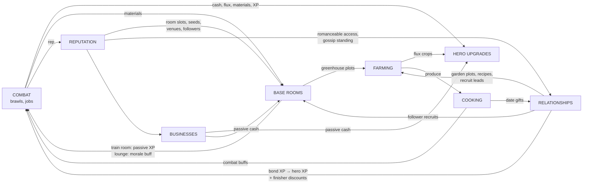

# 02 — Game Design: Core Loops & Systems

**Binding upstream:** `01-vision.md` (pillars 1–5, tone bible). Hero roster & power kits: `04-characters.md` — this doc defines the *systems* heroes plug into, never individual kits. World/venues: `03-world-minneapolis.md`.

**All numbers below are tunable defaults.** They live in one config file (`design/tuning.json` when implemented), not scattered in code. Ambiguity is a bug: where a rule could be read two ways, the table wins.

---

## 1. Combat — Squad Brawler

### 1.1 The frame

You field **3 heroes** from your recruited roster. You directly control one; squad AI runs the other two; **tap a hero's portrait to swap instantly** (no cooldown on swap itself — swapping is a core move, not a panic button). Streets-of-Rage DNA: side-of-street arenas, readable crowds, launchers, juggles, throws, and furniture that hurts.

**Fight length target: 45–90 seconds** for a standard street brawl. If a fight regularly runs past 2 minutes at intended power level, cut enemy HP — never add player damage nag. Boss/leader fights may run to 3 minutes, hard cap.

### 1.2 Touch controls

Left thumb: **virtual joystick** (floating origin — appears where the thumb lands, dead zone 12% of stick radius). Right thumb: **4 context buttons** in a fixed arc:

| Button | Tap | Hold (≥300ms) | Context override |
|---|---|---|---|
| **ATTACK** | light attack (chains) — **always**, no context overrides on tap | heavy attack (launcher); near a flagged prop, the hold becomes the **environmental attack** instead | — |
| **POWER** | fires the **currently-equipped power move** — heroes unlock up to 3 power moves (per `04-characters.md` / the `moves[3]` schema in 05) and equip exactly 1, swappable in the squad menu | charged version if the equipped move supports it | full meter: **signature finisher** (§1.3) |
| **DODGE/GRAB** | dodge roll in stick direction | — | adjacent stunned/grabbable enemy: throw |
| **SWAP** | swap to next hero (portrait order) | radial: pick specific hero | downed ally targeted: swap-revive |

Rules that make this work on a phone:
- **No directional inputs on buttons.** Never "forward + attack." Direction comes from the stick only; buttons are pure taps/holds.
- **Generous buffering:** inputs buffer 250ms; a tap during a combo queues the next hit.
- **Auto-facing:** attacks magnetize to the nearest valid target within a 60° cone, 2.5m snap range. The player aims *intent*, the game aims *pixels*.
- **Fat targets:** every button ≥ 44pt touch target (≈88px @2x), 12pt gaps.
- Portraits (top-right, 3 stacked) are also swap targets — tap portrait = swap to that hero, works mid-combo.

### 1.3 Combo system

- **Light chain:** 3-hit string (L-L-L), each hit cancels into dodge or power. Third hit knocks back.
- **Launcher:** hold-attack pops a grunt-weight enemy 3m up, 1.2s of juggle airtime. Any hit on an airborne enemy is a **juggle hit** (+25% damage, builds power meter 2×). Bruisers need 2 launchers within 3s to pop ("heavy launch"); leaders can't be launched, only staggered.
- **Team juggling:** AI allies are tuned to contribute one hit to your juggles when in range — the "splash page" moment (pillar 2). Swapping mid-juggle keeps the juggle alive; juggle counter is squad-wide.
- **Throws:** grab a stunned/grabbed enemy → stick direction + release throws them 4m. Thrown enemies are projectiles: 1.5× impact damage to anything they hit, knockdown in a 1.5m radius. Throwing enemies into other enemies is the highest-skill, highest-reward crowd tool. Throw into a wall = wall-splat (2s stun).
- **Environmental attacks:** flagged props (parking meters, patio chairs, trash cans, bike racks, café tables) show a subtle ink-outline pulse when in range. Triggered on **ATTACK-hold** near the prop — a tap never steals your light chain (input theft is a bug class, not a tradeoff). One input, big juicy result: parking meter uproot = 3-hit club with coin-spray VFX on break; patio chair = one throw. Props respawn per-fight, 4–8 per arena. Environmental kills grant +20% material drops.
- **Signature finishers:** each **hero** has exactly ONE signature finisher (10 total — the anim budget in docs/06 caps unique animations at 3 power moves + 1 signature per hero; per-pairing cinematics are explicitly out of scope). Triggered via POWER at full meter: a 2.5s canned cinematic-lite move, 400% of a light hit in a 4m radius + guaranteed knockdown, costs the full power meter. **Pair flavor is garnish, not animation:** if an ally is within 5m, they snap a canned assist pose and the pairing fires a shared VO bark line — per-pairing *data* (pose ID + bark line rows in `04-characters.md`), zero unique animation. These are the screenshot moment — camera pulls in, time dilates to 0.5× for 0.8s.

### 1.4 Stamina & power economy

Two meters, deliberately asymmetrical:

| Meter | Fills by | Spends on | Notes |
|---|---|---|---|
| **Stamina** (green, per-hero) | regen 20%/s after 1s of not spending | dodge (25%), throw (20%), heavy/launcher (15%) | Light attacks are FREE. You can always fight; stamina gates *defense and burst*, so button-mashing is viable but suboptimal, never punished with a dead hero. |
| **Power** (violet, per-hero) | landing hits (1 pt/light, 3/juggle hit, 4/throw impact), taking damage (0.5/point of HP lost) | power move (30 pts), charged power (60), signature finisher (100 = full) | Persists between fights at 50% decay. Benched heroes gain power at 30% of the active hero's rate — swapping cycles fresh meters, rewarding swap play. |

Getting hit interrupts stamina regen for 1.5s. **Second wind (precise rule):** when the **last standing hero** would drop below 1 HP, they instead survive at 1 HP with **2s of invulnerability** — once per brawl. No heal, no other trigger conditions.

### 1.5 Enemy archetypes

Readable crowds = strict archetype silhouettes and telegraphs. Every attack that deals >10% player HP has a ≥0.6s telegraph (windup pose + ink-flash outline).

| Archetype | Role | HP (× grunt) | Behavior | Counterplay |
|---|---|---|---|---|
| **Grunt** | crowd volume | 1× | approaches in arcs, attacks in max groups of 2 at once (attack-token system: only 2 melee tokens live regardless of crowd size) | anything; they're juggle food |
| **Bruiser** | armor check | 4× | slow, armored (no flinch on lights), grab-punishes mashing | heavy launch ×2, throws, environmental hits pierce armor |
| **Ranged** | positioning check | 1.5× | keeps 8m, fires telegraphed 0.8s shots, repositions when approached | dodge-cancel approach, throw a grunt at them, swap to a gap-closer hero |
| **Leader** | mini-boss, has a POWER | 8–12× | one signature superpower per leader type (shield dome, tremor slam, blink-flank, crowd-buff aura), commands grunts (buffed while leader alive) | break the power's tell; leaders take +50% damage for 3s after their power whiffs |

Crowd composition budget: a standard brawl is **8–14 enemies total, ≤6 on screen**, spawned in 2–3 waves. Waves overlap by design (next wave enters as current drops to 2) so pacing never flatlines.

### 1.6 Difficulty ramp

- **Rep-tier scaling** (see §2.3): enemy composition — not HP sponging — is the primary ramp. **Ranged and bruiser enemies both appear within the player's first three encounters** — positioning and armor are the hour-one decisions, not later unlocks. Tier 4 fights mix leaders, dual ranged, hazard arenas.
- **Hits must matter from hour one:** tier-1 grunt hit = **12% of player max HP** (tunable). Eating 3 unanswered hits is a real dent, so "tap attack again" is never the whole decision.
- **Splash Rating:** every fight ends with a D→S rating scoring move variety, juggle hits, throws, environmental use, and swap/assist play. It **visibly multiplies the loot splash ×1.0–×1.5** and is printed on it. Mash stays viable; its cost is now on every payout, so mastery is legible without damage numbers.
- Numeric scaling capped at **+15% HP / +20% damage per rep tier**. Past that, we ramp with mechanics: new leader powers, mixed-archetype waves, arena hazards (traffic, light-rail crossings, patio fire pits).
- **Rubber-banding, gently:** if the squad wipes twice on the same encounter, next attempt spawns one fewer bruiser and drops a food pickup. Invisible, never announced.
- Fights the story requires you to *lose* do not exist. Fights you can *skip via relationship or reputation* do (pillar 4).

### 1.7 What makes it fun on a phone (checklist, enforced)

1. 45–90s fights — one bus stop, one fight.
2. Zero fiddly inputs: no gestures, no double-taps, no directional-button combos.
3. Mash is viable, mastery (juggles, throws, swap-cycling, environment) is 2–3× faster, pays up to ×1.5 loot via Splash Rating, and looks incredible.
4. Every fight ends with a **loot splash** (cash + flux + materials fountain, Splash Rating stamped on it) and a squad walk-off pose. Dopamine is a deliverable.
5. Damage numbers OFF by default; hit-stop, ink-flash, and knockback communicate impact.

---

## 2. Progression & Upgrades

### 2.1 Per-hero upgrade trees

Every hero has **3 branches × 7 nodes** (21 nodes/hero):

| Branch | Theme | Example node types |
|---|---|---|
| **Raw Power** | damage, HP, meter gain | +8% damage/node, +10% HP, +stamina cap, armor-pierce on heavies |
| **Utility** | squad & world value | AI-ally behavior upgrades, +swap bonus (swapping in grants 1s of 20% damage buff), out-of-combat perks (haggle discount, scavenge yield), squad power-meter share |
| **Signature Evolution** | the hero's signature finisher (from 04) grows | 3 evolution nodes that visibly transform the signature + 4 modifier nodes (range, charge speed, status effect). Node 7 = the "poster" version. |

Node costs: **cash + flux**, curve per node index within a branch (n = 0–6): `cost(n) = base × 1.5^n`. Defaults: cash base 100, flux base 7. That sums to ≈3,217 cash + 225 flux per branch, **≈9,650 cash + 676 flux for a full 21-node tree** — roughly 10–12 hours of mixed play for a mainline hero. (Node 7 of a branch = 1,139 cash + 80 flux.) No respec cost for Utility; Power/Signature respec costs 25% of spent flux back (choices should have light weight, not regret).

### 2.2 Hero XP — two spigots

Hero levels (1–30) gate tree tiers (nodes 1–2 free at Lv1, 3–4 at Lv10, 5–7 at Lv20).

- **Combat XP:** shared to the full squad of 3 (100% controlled hero, 70% AI allies) — swapping is never an XP tax. Benched roster heroes get 20% trickle.
- **Bond XP:** each **bond level with that hero** (friendship or romance track, §5) grants a flat hero-XP grant equal to ~one tier-appropriate brawl *and* a permanent perk (e.g., bond 3 = that hero's signature finisher costs 90 power instead of 100). **Hanging out with your bruiser makes them a better bruiser.** This is pillar 3 and pillar 4 shaking hands; do not cut it for balance reasons — rebalance combat XP instead.
- **Training room** (§3) adds passive XP as a third minor spigot, capped so it never outpaces play.

### 2.3 Player Reputation (account progression)

**Rep** is account-level, earned from everything: brawls (+10–40), story beats (+50–200), faction jobs, first-time venue discoveries, bond milestones (+25). Rep tiers (5 tiers for the slice, thresholds 0 / 500 / 1500 / 3500 / 7000 — **1-indexed: tier 1 = 0 rep**, every player is tier 1 at boot):

- Gate **content**, not power: new districts' job boards, club VIP access, faction storylines, recruitable followers, base room unlocks.
- Feed the **gossip system**: NPC greeting lines and prices reference your tier ("aren't you the one from the Lagoon thing?").
- Rep never decreases from combat. It CAN take temporary district-level hits from gossip fallout (§5.5) — social consequences, not grind punishment.

### 2.4 Currencies

| Currency | Sources | Sinks | Feel |
|---|---|---|---|
| **Cash** | brawl loot, jobs, businesses, crop/dish sales | upgrade nodes, base rooms, dates, gifts, fashion | fluid, always something worth buying |
| **Flux** | brawl drops (crystallized from defeated supers), **flux crops** (§3), leader kills (3–8) | upgrade nodes (the real gate), signature evolutions, greenhouse seed tiers | scarcer; the combat↔farming bridge. **Parity rule: one flux plot-cycle ≈ one good brawl's flux take.** With the hard 4-plot cap (§3.2), farm and fight lanes both land on ~60 flux/real-hour mid-game — neither runs away. |

No premium currency. No energy system. Ever.

---

## 3. Base Building & Resources

### 3.1 The warehouse

One base: a converted **Uptown warehouse**, **owned from minute one** (per docs/03; docs/01's loop starts "wake at base"). At boot it is mostly derelict — the player sleeps on a **base cot, available from minute one**. The **~30-min story beat unlocks the room system**, not the building. **Grid-free room-slot system:** 8 fixed room slots — 4 open with the room-system unlock, +4 via rep: **tier 2 grants two slots, tiers 3 and 4 one each**. You assign a room *type* to a slot and level the room 1→3. **Room types may not duplicate in the slice** (spare slots are reserved for post-slice room types and decor staging). Slots differ only in cosmetics/adjacency flavor — no placement puzzle, no furniture Tetris. Decor is a separate free-placement cosmetic layer (no stats) because people love it and it costs us nothing.

### 3.2 Room types

| Room | Lv1 → Lv3 effect | Build/upgrade cost (cash + materials) | Staffing effect |
|---|---|---|---|
| **Train Room** | passive hero XP to 2 assigned heroes: 0.5%/1%/1.5% of their level bar per in-game hour | 800 / 2,000 / 5,000 | staffed follower: +50% rate |
| **Flux Greenhouse** | **4 flux plots at every level (hard cap — parity, §2.4)**; levels unlock flux crop *tiers* 1/2/3 and add 4/8 normal produce plots at Lv2/Lv3 | 1,000 / 2,500 / 6,000 | staffed: auto-waters (harvest stays manual & tactile) |
| **Workshop** | crafts gear mods & environmental "care packages"; Lv3 unlocks material→flux transmute (lossy, 10:1) | 600 / 1,800 / 4,500 | staffed: crafting queue 1→3 slots |
| **Lounge** | squad **morale buff**: +5/8/12% combat XP **until next sleep**, refreshed by visiting; Lv3 hosts squad hangout scenes | 500 / 1,500 / 4,000 | staffed: also +5% power meter gain |
| **Private Quarters** | the romance venue: date-night invitations, morning-after scenes (tone bible rules, §5.6); Lv2+ required to invite anyone over | 700 / 2,000 / — (Lv3 is story) | never staffed |

### 3.3 Resource loops

- **Cash:** faction jobs (repeatable, 100–400), story beats, **businesses** (rep-gated passive stakes in local venues, e.g., the co-op grocery from docs/03: 150 per in-game day, ticked on sleep, collected at base terminal, capped at 2 in-game days so it never demands login anxiety), crop & cooked-dish sales.
- **Materials:** brawl drops (every enemy, 1–3; environmental kills +20%), scavenging nodes in the world (dumpster/alley/shoreline, respawn daily), job rewards. Spent on rooms, workshop crafts.
- **Flux:** §2.4. Grown, looted, transmuted (badly).

### 3.4 Followers (non-hero units)

Recruitable from **factions** at rep milestones and via side stories — bartenders, mechanics, retired supers, a very intense community gardener. Followers are NOT combat units. They:

1. **Staff rooms** (one each, effects above).
2. Go on **timed off-screen missions** from the base job board: 2–4 real-hour timers, party of 1–3 followers, returns cash/materials/flux/rarely a recruit lead. Success chance from follower traits vs. mission tags (shown as simple 1–3 star fit). Missions never fail catastrophically — worst case is reduced loot and a funny debrief line (pillar 4: even mission reports are characterful).

Roster cap for the slice: **8 followers**. Followers have opinions and schedules too — they're NPCs who moved in, not staff-bots.

---

## 4. Stardew Rhythm — Day Cycle & Farming

### 4.1 The clock

- **In-game day = 20 real minutes** (tunable; 1 in-game hour = 50s). Clock pauses in menus, dialogue scenes, and dates — never lose daylight to reading.
- Phases use docs/03's enum **verbatim**: **MORN** (6a–11a), **DAY** (11a–5p), **EVE** (5p–10p), **LATE** (10p–3a). 3a forces sleep (soft: screen dims, hero autowalks home, small energy penalty — no Stardew pass-out robbery). Both the enum and the hour boundaries live in `tuning.json`.
- **LATE runs long where it counts:** inside venues tagged SOCIAL or ROMANCE, the game clock runs **4× slower** during LATE — a club night is ~12+ real minutes of playable time, not a 3-minute sprint to the forced-sleep bell.
- Phases gate **NPC schedules** (pillar 1: everyone has somewhere to be) and **venue hours**: co-op grocery in MORN, gym in DAY, restaurants in EVE, clubs LATE-only. The club district is dead at 9 AM and that's correct.
- Sleeping advances to next MORN, triggers: crop growth tick, business income tick, gossip propagation, autosave. (Follower missions run on real time regardless — §3.4.)

**Time bases (convention — this table wins over any prose):**

| System | Time base |
|---|---|
| Crops (growth) | in-game clock — advance on sleep tick |
| Businesses (income accrual + 2-day cap) | in-game clock — tick on sleep |
| Buffs (lounge morale, food) | in-game clock — lounge lasts until next sleep; food buffs per-fight/per-date |
| **Follower missions** | **REAL time** (2–4 real hours), timestamp checked at load — the ONLY real-time system |
| Everything else | in-game clock |

### 4.2 Farming

Two sites: the **base greenhouse** (§3.2) and a **community garden plot** near the lake: **2 free starter beds; additional beds are rentable** for cash (per docs/03), and befriending the garden coordinator discounts the rent — relationships unlock dirt, pillar 3.

- **Flux crops** (greenhouse only): 3 tiers, grow in 2/4/7 in-game days, yield 8/20/45 flux. Seeds cost cash; tier 2–3 seeds are rep/story gated.
- **Normal produce** (both sites): tomatoes, sweet corn, hot peppers, herbs; 1–3 day cycles; sold for cash or cooked.
- **Tactile, not a chore:** watering is one tap-hold sweep per bed (whole bed, not per-tile), ≤10 seconds for a full greenhouse. Harvest is tap-to-pop with juicy VFX. **Total daily farm upkeep ≤ 60 seconds.** If a playtest shows >90s, cut interactions, not plots. No crop death — unwatered crops pause, never wilt (punishing absence violates the no-nag rule).
- **Cooking** (lounge kitchenette or base Lv2): recipes from NPCs. Dishes = consumable combat/social buffs (+10% damage for a fight, +charm on a date) and **date gifts** — a hotdish made from your own corn is worth 3× a store gift in bond XP, and the NPC comments on it. Cooking uses hunger-need food slot too (§5.4).

---

## 5. Relationships, Dating & Sims Needs

### 5.1 Opinion axes

Every named NPC tracks four axes toward the player, **−100..+100**: **Respect, Attraction, Fear, Trust**. Axes move from witnessed actions, dialogue choices, gifts, gossip received, and faction alignment. Axes are *inputs*, not the relationship itself — they gate which track options appear (e.g., romance confession requires Attraction ≥ 30 and Trust ≥ 10; intimidation dialogue requires Fear ≥ 25, and using it drops Trust). NPCs also hold opinions of *each other* (pillar 1); ours is just the player-facing slice of that system.

### 5.2 Tracks & milestones

Two tracks per eligible NPC: **Friendship 0–5** and **Romance 0–5** (romance available only for flagged adult romanceables — see roster in `04-characters.md` and NPC sheets in 03). Track XP from: quality time (shared activities > gift spam — gift bond XP soft-caps at 2 gifts/NPC/day), dialogue depth, remembered callbacks, dates.

Each level-up = a **milestone scene** (written, not procedural): friendship scenes reveal wants/flaws/secrets; romance milestones escalate — first flirt (R1), first date (R2), the almost-moment (R3), exclusive-or-not conversation (R4), established partner (R5). Heroes in your roster use the same system; their bond levels also pay hero XP (§2.2).

### 5.3 Dates

Dates are **designed activities**, not cutscenes: **Club Night** (rhythm-tap dance minigame + VIP choice beat), **Lake Walk** (golden-hour walk-and-talk, 3 choice beats, skippable stone-skipping toy), **Restaurant** (order-reading minigame — remembering their tastes from prior dialogue pays off — + a charged conversation). Each date: 3–5 minutes real time, costs cash (50–200), ends with a choice beat that moves axes and track XP. Great dates end on a **cut-to-black or an almost** — the morning-after or the walk-home is where the writing lands (tone bible).

### 5.4 Player needs — LIGHT

Three needs only: **Energy, Social, Hunger.** Each 0–100, decaying slowly across a day.

- Needs **gate buffs, never nag**: above 60 in a need grants its buff (Energy: +10% stamina regen; Social: +10% bond XP; Hunger/well-fed: +5% max HP). Below 60: no buff, **no debuff**, no meter icons pulsing red, no autonomy failures, no wetting yourself. This is the entire system.
- Refills: sleep (energy), any hangout/date/lounge visit (social), eating (hunger — cooked > bought).

### 5.5 Jealousy, exclusivity, gossip

- Dating multiple NPCs is allowed pre-exclusivity. Every romance R4 scene forces the **exclusivity conversation**; the NPC has a written stance (some want exclusivity, at least one canonically doesn't — variety is content).
- **Gossip propagation:** flirt/date events witnessed by NPCs (or in public venues) enter the gossip graph; each sleep tick, gossip spreads 1 social hop with decaying fidelity. A partner who *hears* you're seeing someone else: −Trust, confrontation scene next encounter (written per character: fury, ice, hurt, or amused negotiation — per their sheet).
- Cheating post-exclusivity that gets discovered: relationship drops to R2, district rep hit (−10% prices become +10% at their allied venues for 3 days), and the gossip system makes sure the *next* romanceable knows your reputation. Consequences make it fun (tone bible). Recovery arcs exist but are written, slow, and never guaranteed.
- **Rejection is real:** low-compatibility or wronged NPCs refuse tracks. Refusal scenes are written as characterful content, never a fail-buzzer.

### 5.6 Fade-to-black contract (hard rules, restated for implementers)

Per `01-vision.md` tone bible, non-negotiable: escalation → charged scene → **cut to black**; storytelling resumes at the morning-after. No explicit sex, no nudity, no underage-coded characters anywhere near romance content, no coercion mechanics, "no" from an NPC is final for that beat. Any scene file violating this fails review, full stop.

---

## 6. Economy & Sinks

### 6.1 Flow map (pillar 3 made literal)

Audit rule: **every system must have ≥2 outbound edges.** A proposed feature that only feeds itself gets cut (pillar 3).

### 6.2 Income vs. sinks, sanity curve

Target: a mid-game player (rep tier 3) earns **~1,500 cash + ~60 flux per real hour** of mixed play. Sinks at that stage: upgrade nodes (~340–760 cash each, nodes 4–6 on the §2.1 curve), room Lv2s (~2,000), dates (50–200), gear mods (~300). **Sanity rule: the next meaningful purchase is always ≤ 45 minutes of play away.** Price curves are geometric (×1.6 nodes, ×~2.5 room levels) against roughly linear income growth per tier — early game feels rich, late game asks for intent, nothing asks for a week.

**Price-modifier stacking:** district/territory price modifiers (docs/03), gossip-fallout modifiers (§5.5), and any other price effects **do not stack — the single worst applicable modifier wins.** Hard rule for `economy.json`.

Anti-grind guarantees: (1) no sink accepts only one currency source — everything has a combat path AND a farm/social path; (2) repeatable jobs rotate daily so no single job is ever the optimal-forever grind; (3) if telemetry shows >30% of a currency earned from one activity across the population, retune that week.

### 6.3 Money-out summary

Cash sinks in priority order of designed spend: upgrade nodes > base rooms > dates & gifts > cosmetics/fashion > consumables. Flux sinks: upgrade nodes > signature evolutions > seed tiers. Materials: rooms > workshop crafts. Nothing is cash-only-forever; cosmetics are the intended late-game cash faucet drain.

---

## 7. Session Design

### 7.1 The 5-minute phone session

Must be fully satisfying: open at base → water/harvest (≤60s) → collect business income & finished follower missions → launch **one** job-board brawl (45–90s) → bank loot, queue a follower mission, maybe buy one node. Every step ≤3 taps from the base terminal. A 5-minute session should always advance ≥2 systems (pillar 3 self-test).

### 7.2 The 30-minute couch session

Story beat → 2–3 brawls → a date or milestone scene → base build decision → next-day plan. The day clock (20 min) means a couch session spans ~1.5 in-game days — one full "wake to club" loop from `01-vision.md` §"15 minutes", plus change. EVE/LATE content (clubs, dates — with LATE's 4× venue dilation, §4.1) is deliberately the *deep* content: long sessions naturally drift into the social game.

### 7.3 Autosave rules

- Autosave triggers: sleep, fight end, scene end, room purchase, entering/leaving a building, app background/`visibilitychange` (PWA: flush to IndexedDB immediately — mobile browsers kill tabs without warning).
- **Never** save mid-fight or mid-scene; a killed tab resumes at the pre-fight/pre-scene checkpoint with resources as they were (fights are ≤90s; losing one is losing nothing).
- Single save slot + 3 rolling backup snapshots (last 3 sleep saves) for corruption recovery. Save size budget ≤ 2MB. All local; no account server in the slice.
- **Follower missions are the only real-timestamp system** (checked at load — closing the app never wastes a timer). Crops, businesses, and buffs advance on the in-game clock via sleep ticks (§4.1 time-base table); income caps (§3.3) mean staying away is never punished.

---

## 8. Vertical-Slice Scope Notes

Orchestrator-final scope calls; build to these, not to the full design surface:

- **Heroes:** the slice ships **6 of the 10 heroes recruitable**. All 10 are designed in `04-characters.md`; the remaining 4 are post-slice content (their data rows exist, their recruit arcs do not).
- **Businesses (§3.3) are the designated first cut** if the base milestone runs long. Cutting them removes only a redundant passive-cash edge — the §6.1 audit rule (≥2 outbound edges per system) still holds for every remaining node without BIZ.
- **Date minigames:** only the two designed ones ship — Club Night rhythm-tap and Restaurant order-reading. The Lake Walk's stone-skipping and all other venue toys are **animation + buff interactions** in the slice (tap, watch, get the buff/bond beat), not minigames.
- **STEAL exists in-slice.** "Heat" is defined as **pure social fallout**: witness trust loss, gossip-graph spread, faction price bumps (worst-applicable-wins rule, §6.2). There is **no police/wanted system** — do not build one.

---

## Appendix: tuning defaults index

| Knob | Default | Section |
|---|---|---|
| Fight length target | 45–90s | 1.1 |
| Input buffer | 250ms | 1.2 |
| Attack-token cap (simultaneous melee) | 2 | 1.5 |
| On-screen enemy cap | 6 | 1.5 |
| Per-tier enemy scaling cap | +15% HP / +20% dmg | 1.6 |
| Tier-1 grunt hit | 12% of player max HP | 1.6 |
| Splash Rating loot multiplier | ×1.0–×1.5 (D→S) | 1.6 |
| Tree size | 3 branches × 7 nodes | 2.1 |
| Node cost curve | 100 cash / 7 flux × 1.5^n, n = 0–6 per branch | 2.1 |
| Rep tier thresholds | 0/500/1500/3500/7000 (tier 1 = 0) | 2.3 |
| Room slots | 4 at unlock + 2 (tier 2) + 1 + 1 (tiers 3–4); no duplicate types | 3.1 |
| Flux plot cap | 4 at every greenhouse level | 3.2 |
| Follower mission timers | 2–4 real hours (only real-time system) | 3.4 |
| In-game day | 20 real minutes | 4.1 |
| Day phases | MORN/DAY/EVE/LATE; forced sleep 3a | 4.1 |
| LATE venue time dilation | 4× slower in SOCIAL/ROMANCE venues | 4.1 |
| Daily farm upkeep budget | ≤60s | 4.2 |
| Opinion axes range | −100..+100 | 5.1 |
| Track levels | 0–5 both tracks | 5.2 |
| Needs buff threshold | ≥60, buff-only | 5.4 |
| Mid-game income target | 1,500 cash + 60 flux / real hr | 6.2 |
| Next-purchase horizon | ≤45 min | 6.2 |
| Save size budget | ≤2MB | 7.3 |
